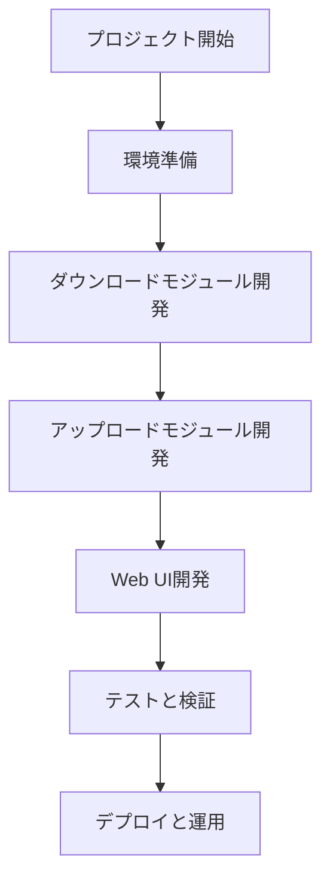

# 動画ダウンロード・アップロードWebアプリ開発プラン

## プロジェクト概要
指定されたサイトから動画を自動ダウンロードし、アップロードし、進捗状況を表示するWebアプリを開発します。Streamlitを使用してデプロイします。

## プラン概要

### 詳細なプラン

1. **環境準備**
   - **必要なライブラリのインストール**
     - **スクレイピング**: BeautifulSoup、Requests
     - **ダウンロード**: youtube-dl、ffmpeg
     - **アップロード**: smbprotocol
     - **Webフレームワーク**: Streamlit
   - **開発環境の設定**
     - **Webサーバー**: Streamlit
     - **DB**: SQLite
     - **認証環境**: OAuth2.0
   - **参考資料の確認と分析**
     - **参考資料**: reference/ss-01.png
     - **ルールファイル**: rules.md

2. **ダウンロードモジュール開発**
   - **自動検索機能**
     - **検索条件**: 公開日が3日以上経過、評価70%以上
     - **検索範囲**: tktube.comのカテゴリーFC2ページ
   - **ダウンロード条件チェック**
     - **公開日**: 本日から3日以上経過
     - **評価**: 支持率70%以上
     - **トリガー**: サーバーへのアップロード完了していないコンテンツ
   - **ダウンロードキュー管理**
     - **キュー優先度**: 高評価コンテンツ優先
     - **同時ダウンロード数**: 5個まで
   - **進捗状況通知機能**
     - **表示方法**: Streamlit上でのプログレスバー
     - **通知方法**: 完了時メール通知

3. **アップロードモジュール開発**
   - **サーバー接続機能**
     - **接続方法**: SMB接続
     - **サーバー情報**: filehub/UsbDisk1_Volume1/Adult/
     - **認証情報**: user: admin, password: admin
   - **ファイル管理機能**
     - **フォルダ作成**: FC2-PPV-***（頭3桁）に基づくフォルダ作成
     - **重複チェック**: FC2-PPV-*******（頭7桁）をチェック
   - **アップロード進捗管理**
     - **表示方法**: Streamlit上でのプログレスバー
     - **再開機能**: 中断後の再開可能

4. **Web UI開発**
   - **ダッシュボード画面**
     - **表示内容**: ダウンロードキュー、アップロードキュー
     - **操作ボタン**: Auto Start、中断、リジューム
   - **進捗状況表示**
     - **ダウンロード**: %表示
     - **アップロード**: %表示
   - **設定画面**
     - **ダウンロード条件**: 公開日、評価設定
     - **保存先**: サーバー接続情報

5. **テストと検証**
   - **基本機能テスト**
     - **ダウンロード**: 頭3桁フォルダ作成、重複チェック
     - **アップロード**: サーバー接続、プログレスバー表示
   - **同時ダウンロードテスト**
     - **同時数**: 5個
     - **安定性**: 中断テスト、再開テスト
   - **アンプラグテスト**
     - **復旧テスト**: ネットワーク復帰時自動再開
   - **安全性テスト**
     - **認証テスト**: adminユーザーでのみ接続可能
     - **ログ管理**: アクセスログ、エラーログ

6. **デプロイと運用**
   - **サーバー構築**
     - **環境**: Linuxサーバー
     - **ソフトウェア**: Streamlit、SQLite、Samba
   - **バージョン管理**
     - **ツール**: Git
     - **リリースノート**: 変更履歴管理
   - **監視機能**
     - **監視項目**: CPU、メモリ、ダウンロード/アップロード速度
     - **通知方法**: Slack連携
   - **ユーザートレーニング**
     - **マニュアル作成**: 使用方法、トラブルシューティング
     - **トレーニングセッション**: 操作説明